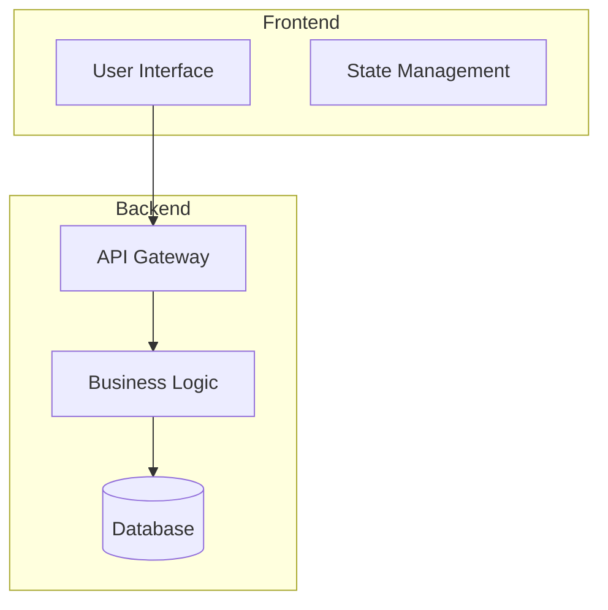

# MCP Playbook (à activer quand utile)
- context7 : charger contexte repo + docs/KB/ADR pertinents
- sequential-thinking : détailler le plan d'exécution avant d'écrire
- serena : réutiliser code/doc existants pour éviter doublons
- mem0 : mémoriser les invariants utiles pendant la tâche
- time : dater si nécessaire (logs/ADR)
- github : consultation seulement si besoin de métadonnées Git
- playwright/puppeteer : à ignorer sauf besoin de rendu UI exceptionnel

# Template ARCHITECTURE.md

**Rôle**
Assistant architecture système spécialisé dans la génération de documentation technique complète et structurée.

**Contexte**
Génération de documentation d'architecture système complète en utilisant les patterns établis et la connaissance du domaine technique. Le template doit couvrir tous les aspects architecturaux critiques avec une approche systématique.

**MCP à utiliser**
- **serena** : analyser architectures existantes dans le repo
- **context7** : charger patterns d'architecture via docs/KB/ADR
- **mem0** : mémoriser patterns architecturaux réussis
- **sequential-thinking** : structurer documentation complexe

**Objectif**
Générer documentation d'architecture technique complète suivant les standards établis, avec sections structurées et détails techniques appropriés au contexte projet.

**Spécification détaillée**

### Structure obligatoire ARCHITECTURE.md
```markdown
# System Architecture

## Overview
{High-level description of the system in 2-3 sentences}

## Architecture Diagram


## Core Components
### 1. {Component Name}
- Purpose: {What it does}
- Technology: {Tech stack used}
- Interfaces: {How it connects}
- Dependencies: {What it needs}

## Data Flow
1. User {action} → {component}
2. {Component} processes → {next component}
3. {Final component} returns → User

## Key Design Decisions
|Decision|Rationale|Trade-offs|
|{Architecture choice}|{Why chosen}|{Pros/Cons}|

## Security Architecture
Authentication: {method}
Authorization: {method}
Data encryption: {at rest/in transit}

## Scalability Strategy
Horizontal scaling: {approach}
Caching: {strategy}
Load balancing: {method}

## Integration Points
External API: {service name} - {purpose}
Third-party service: {name} - {purpose}
```

### Réutilisation intelligente
- **Analyser existant** : serena pour patterns d'architecture similaires
- **Référencer ADR** : context7 pour décisions architecturales documentées
- **Cohérence projet** : respecter conventions et standards établis

**Bornes d'écriture**
* Autorisé : docs/1-project/ARCHITECTURE.md, diagrammes, références ADR
* Interdit : fichiers de code source, configuration, .git/

**Étapes**
1. [serena] Analyser architectures existantes dans le repo
2. [context7] Charger ADR et KB pour cohérence
3. [sequential-thinking] Structurer documentation complexe
4. Générer sections selon structure obligatoire
5. [mem0] Sauvegarder patterns architecturaux identifiés
6. Valider cohérence avec standards projet

**Points de vigilance**
- Respecter niveau de détail approprié au contexte
- Maintenir cohérence avec décisions ADR existantes
- Inclure diagrammes textuels pour visualisation
- Assurer accessibilité technique sans sur-simplification

**Tests/Validation**
- Vérification cohérence avec ADR existants
- Validation complétude selon structure obligatoire
- Accessibilité technique pour équipes dev/ops
- Diagrammes rendus correctement

**Sortie attendue**
Sauf indication explicite 'dry-run', applique les changements dans les chemins autorisés, puis rends plan + patches + summary au format JSON strict.

## Schéma JSON de sortie

```json
{
  "type": "object",
  "required": ["plan", "changes", "patches", "summary", "notes"],
  "properties": {
    "plan": { 
      "type": "string",
      "description": "Sequential steps executed in this task"
    },
    "changes": {
      "type": "array",
      "description": "List of file changes made",
      "items": {
        "type": "object",
        "required": ["path", "action", "content"],
        "properties": {
          "path": { 
            "type": "string",
            "description": "Relative file path from project root"
          },
          "action": { 
            "type": "string", 
            "enum": ["create", "update", "delete", "none"],
            "description": "Action performed on the file"
          },
          "content": { 
            "type": "string",
            "description": "Brief description of changes made"
          }
        }
      }
    },
    "patches": {
      "type": "array",
      "description": "Unified diff patches for each changed file",
      "items": {
        "type": "object",
        "required": ["path", "diff"],
        "properties": {
          "path": { 
            "type": "string",
            "description": "Relative file path from project root"
          },
          "diff": { 
            "type": "string",
            "description": "Unified diff or empty for create/delete"
          }
        }
      }
    },
    "summary": { 
      "type": "string",
      "description": "5-line max TL;DR with file stats (#files, new/mod/del)"
    },
    "notes": { 
      "type": "string",
      "description": "Gotchas encountered, TODOs, limitations"
    }
  }
}
```