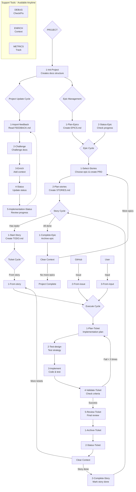

# Claude WM CLI

A comprehensive Go-based CLI tool for agile project management designed for solo developers. Provides intelligent workflow guidance, atomic state management with JSON schemas, and seamless integration with Git and GitHub. Built with production-ready patterns including file locking, corruption protection, and atomic operations.

## Project Structure

```
├── cmd/                        # CLI commands (18 files)
│   ├── root.go                # Root command with global config
│   ├── interactive.go         # Context-aware interactive navigation
│   ├── epic.go, story.go      # Entity management commands
│   ├── ticket.go              # Interruption and task handling
│   ├── project.go, config.go  # Project and configuration management
│   ├── git.go, github.go      # Version control and issue integration
│   └── ...                    # Additional utility commands
│
├── internal/                   # Core business logic (48 files)
│   ├── epic/                  # Epic CRUD with atomic operations
│   ├── story/                 # Story management and generation
│   ├── ticket/                # Ticket/interruption system
│   ├── state/                 # Atomic JSON state management
│   │   ├── atomic.go          # Atomic file operations (temp+rename)
│   │   ├── corruption.go      # State validation and recovery
│   │   └── performance.go     # Large file optimization
│   ├── navigation/            # Context detection and suggestions
│   ├── workflow/              # Workflow analysis and validation
│   ├── git/                   # Git integration with state versioning
│   ├── github/                # GitHub OAuth and issue sync
│   ├── locking/               # Cross-platform file locking
│   ├── config/                # Hierarchical configuration management
│   └── model/                 # Core interfaces and error types
│
├── docs/                       # Project documentation structure
│   ├── 1-project/             # Global project context
│   ├── 2-current-epic/        # Active epic with stories.json
│   ├── 3-current-task/        # Current task implementation
│   └── archive/               # Completed work history
│
└── .claude-wm/                 # Configuration and schemas
    └── .claude/
        ├── commands/templates/schemas/  # JSON Schema validation
        │   ├── epics.schema.json       # Epic structure validation
        │   ├── stories.schema.json     # Story structure validation
        │   ├── current-task.schema.json # Task structure validation
        │   ├── iterations.schema.json   # Task iteration tracking
        │   └── metrics.schema.json     # Project metrics schema
        └── hooks/                      # PostToolUse validation hooks
```

## Architecture & Implementation Status

### ✅ **Production-Ready Components**
- **Atomic State Management**: Temp-file + rename pattern prevents corruption
- **JSON Schema Validation**: 7 comprehensive schemas with PostToolUse hooks
- **File Locking System**: Cross-platform (Unix/Windows) concurrent access prevention
- **Git Integration**: Automatic state versioning, backup points, and recovery
- **GitHub OAuth & Sync**: Issue-to-ticket mapping with rate limiting
- **Epic/Story/Ticket CRUD**: Complete lifecycle management with validation
- **Interactive Navigation**: Context-aware menu system with intelligent suggestions
- **Error Recovery**: Multi-layer corruption detection and automatic repair
- **Performance Optimization**: Streaming JSON parser, memory pooling, lazy loading

### 🔄 **Beta-Ready Features**
- **Interruption Context**: Stack-based context preservation (70% complete)
- **Advanced Analytics**: Project metrics and performance tracking (80% complete)
- **Task Preprocessing**: Complex task analysis and iteration tracking (75% complete)

### 🚧 **Development Features**
- **Plugin Architecture**: Extensible command and workflow system (40% complete)
- **Webhook Integration**: Real-time GitHub event handling (planned)
- **Multi-Project Support**: Workspace-level management (planned)

## Core Technical Features

### **Robustness & Reliability**
- **Atomic Operations**: All state changes use temp-file + rename pattern
- **Schema Validation**: 7 JSON schemas with automated PostToolUse hooks  
- **Corruption Protection**: Multi-layer validation with automatic recovery
- **File Locking**: Cross-platform exclusive locks prevent concurrent access
- **Backup System**: Automatic backup creation with retention policies

### **Developer Experience**
- **Context-Aware Navigation**: CLI detects project state and suggests next actions
- **Intelligent Workflow**: Hierarchical Project → Epic → Story → Task progression
- **Interruption Handling**: Stack-based context preservation for urgent tasks
- **GitHub Integration**: OAuth authentication with bi-directional issue sync
- **Performance Optimized**: Streaming JSON parser handles large files efficiently

### **Enterprise-Grade Architecture**
- **Modular Design**: 48 internal packages with clear separation of concerns
- **Interface-Driven**: Extensible architecture with plugin support
- **Cross-Platform**: Native Windows and Unix compatibility
- **Comprehensive Testing**: Unit, integration, and performance test coverage
- **Structured Logging**: JSON logs with multiple verbosity levels

## How It Works

**You never need to memorize complex commands!** Just run `claude-wm-cli` and you'll be presented with contextual options based on your project's current state.

### Behind the Scenes
Commands follow a hierarchical path-based structure that the CLI manages internally:
`/{category}/{subcategory}/{command-name}` → `/{category}:{subcategory}:{command-name}`

### Core Workflow Commands

#### Project Level (`/1-project:*`)
- **Init**: `/1-project:1-start:1-Init-Project` - Initialize project structure
- **Update**: `/1-project:2-update:*` - Import feedback, challenge docs, enrich context
- **Epics**: `/1-project:3-epics:*` - Plan and manage epic roadmap

#### Epic Level (`/2-epic:*`)
- **Start**: `/2-epic:1-start:*` - Select and plan epic stories
- **Manage**: `/2-epic:2-manage:*` - Track progress and complete epics

#### Story Level (`/3-story:*`)
- **Manage**: `/3-story:1-manage:*` - Start stories and extract technical tasks

#### Task Level (`/4-task:*`)
- **Create**: `/4-task:1-start:*` - Generate tickets from stories, issues, or input
- **Execute**: `/4-task:2-execute:*` - 5-phase implementation process
- **Complete**: `/4-task:3-complete:*` - Archive and update status

#### Support Tools
- **DEBUG**: `/debug:*` - Project health monitoring and repair
- **ENRICH**: `/enrich:*` - Context enhancement and pattern discovery
- **METRICS**: `/metrics:*` - Performance tracking and analytics
- **LEARNING**: `/learning:*` - Pattern recognition and optimization
- **VALIDATION**: `/validation:*` - Architecture review and quality assurance

## Workflow Architecture



## Quick Start

### Installation & Usage
1. **Build**: `make build` (requires Go 1.21+)
2. **Run**: `./claude-wm-cli` or `claude-wm-cli` if installed
3. **Interactive**: Use interactive menus or direct commands

### Available Commands

```bash
# Interactive navigation (recommended)
claude-wm-cli interactive                 # Context-aware menu system
claude-wm-cli                            # Alias for interactive mode

# Direct commands - Project level
claude-wm-cli init                       # Initialize project structure
claude-wm-cli status                     # Show current project state
claude-wm-cli project import-feedback   # Import FEEDBACK.md
claude-wm-cli project plan-epics        # Plan epic roadmap

# Direct commands - Epic management
claude-wm-cli epic create "Epic Name"    # Create new epic
claude-wm-cli epic list                  # List all epics
claude-wm-cli epic dashboard             # Epic metrics dashboard
claude-wm-cli epic select EPIC-001      # Select active epic

# Direct commands - Story management  
claude-wm-cli story create "Story Name"  # Create new story
claude-wm-cli story list                 # List stories in current epic
claude-wm-cli story generate             # Auto-generate stories from epic

# Direct commands - Ticket/Task management
claude-wm-cli ticket create "Task"       # Create ticket from input
claude-wm-cli ticket execute-full        # Full ticket workflow
claude-wm-cli ticket stats               # Ticket analytics

# System management
claude-wm-cli lock status [files...]     # Check file lock status
claude-wm-cli git backup "description"   # Create Git backup point
claude-wm-cli config show                # Show configuration

# GitHub integration
claude-wm-cli github config              # Setup GitHub OAuth
claude-wm-cli github sync                # Sync issues to tickets
claude-wm-cli github issue 123           # Import specific issue
```

### Example Interactive Session
```
$ claude-wm-cli interactive

🎯 Claude WM CLI - Current Epic: API Development
┌─ Epic Status ─────────────────────────────┐
│ Progress: 3/5 stories completed           │  
│ Active: User Authentication Story         │
│ Next: Story selection or ticket creation  │
└───────────────────────────────────────────┘

Choose an action:
1. 📋 View epic dashboard
2. 📝 Start new story  
3. 🎫 Create ticket (interruption)
4. 🔄 Continue current story
5. ⚙️  Project settings

Your choice: 4
```

### Interruption Handling
Need to handle urgent work? The CLI supports interruptions seamlessly:
- **GitHub Issues**: Automatically creates tickets from issues within the current story branch
- **Direct Input**: Create tickets from your direct requirements
- **Emergency Fixes**: Added as tickets to current story, or create dedicated "Hotfixes" story if needed
- **No Orphaned Branches**: All interruptions integrate into existing workflow structure

### JSON Schema Validation System

The CLI enforces strict data structure validation through comprehensive JSON schemas:

**Entity Schemas**:
- `epics.schema.json` - Epic structure with business value and success criteria
- `stories.schema.json` - Story-task hierarchy with acceptance criteria  
- `current-task.schema.json` - Detailed task structure with 13 required sections
- `iterations.schema.json` - Task attempt tracking with learnings and outcomes
- `metrics.schema.json` - Project analytics with 8 performance dimensions

**Validation Features**:
- **PostToolUse Hooks**: Automatic validation on JSON file writes
- **ID Pattern Enforcement**: EPIC-XXX, STORY-XXX, TASK-XXX format validation
- **Enum Validation**: Status (todo/in_progress/done/blocked) and priority levels
- **Required Field Checking**: Ensures all mandatory fields are present
- **Cross-Reference Validation**: Epic-Story-Task relationship integrity

### Context-Aware Intelligence
The CLI analyzes your project state and suggests appropriate next actions based on:
- JSON schema-validated state files with integrity checking
- Hierarchical workflow position (Project → Epic → Story → Task)
- Dependency validation and prerequisite checking
- GitHub issue availability and synchronization status
- File lock status and concurrent access prevention

**Progressive Guidance**: Context detector analyzes docs structure and provides intelligent next-step suggestions with reasoning.

## Development Roadmap

### Phase 1: Interactive CLI Core (Current)
- Go-based CLI with Cobra/Bubble Tea interface
- JSON state management (epics.json, stories.json...)
- Interactive navigation and contextual options
- Claude Code command wrapper with error handling

### Phase 2: Headless Mode
- JSON API mode for programmatic access (never concurrent with interactive CLI)
- Structured logging and debugging with intermediate status guides
- VSCode extension preparation with CLI separation

### Phase 3: VSCode Extension
- Visual workflow representation using CLI in headless mode
- Real-time project state synchronization (extension calls CLI, displays JSON)
- Integrated development experience with strict CLI-extension separation

## Target Audience

**Solo Developers** who want:
- Streamlined project workflow management with guided navigation
- Context-aware development guidance and next-step suggestions
- Integration with Claude Code commands through intelligent wrapper
- Simple, efficient tools without complexity overhead
- Pragmatic MVP approach - if it doesn't work, rollback and retry

**Note**: Team collaboration not currently planned - focused on solo developer experience first.

## License

[Add your license here]