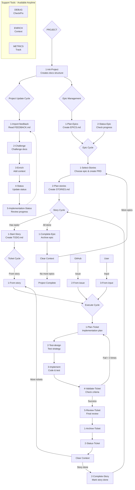

# Claude WM CLI

An intelligent command-line interface that acts as a wrapper for Claude commands, providing both interactive and headless operational modes for sophisticated project workflow management.

## Project Structure

```
docs/
├── 1-project/          # Global project vision and roadmap
├── 2-current-epic/     # Current epic execution
├── 3-current-task/     # Current task breakdown
└── archive/            # Completed epics backup
```

## Features

- **Dual Operation Modes**: Interactive terminal usage and headless VSCode extension integration
- **Intelligent Command Wrapper**: Seamlessly interfaces with Claude commands from `$HOME/.claude/commands`
- **Hierarchical Workflow Management**: PROJECT → EPIC → STORY → TICKET progression
- **Context-Aware Suggestions**: Analyzes project state to recommend appropriate next actions
- **Integrated Git Workflows**: Automatic branch management and structured commits
- **MCP-Powered Intelligence**: Leverages Model Context Protocol for enhanced AI assistance

## Command Structure

Commands follow a hierarchical path-based structure:
`/{category}/{subcategory}/{command-name}` → `/{category}:{subcategory}:{command-name}`

### Core Workflow Commands

#### Project Level (`/1-project:*`)
- **Init**: `/1-project:1-start:1-Init-Project` - Initialize project structure
- **Update**: `/1-project:2-update:*` - Import feedback, challenge docs, enrich context
- **Epics**: `/1-project:3-epics:*` - Plan and manage epic roadmap

#### Epic Level (`/2-epic:*`)
- **Start**: `/2-epic:1-start:*` - Select and plan epic stories
- **Manage**: `/2-epic:2-manage:*` - Track progress and complete epics

#### Story Level (`/3-story:*`)
- **Manage**: `/3-story:1-manage:*` - Start stories and extract technical tasks

#### Ticket Level (`/4-ticket:*`)
- **Create**: `/4-ticket:1-start:*` - Generate tickets from stories, issues, or input
- **Execute**: `/4-ticket:2-execute:*` - 5-phase implementation process
- **Complete**: `/4-ticket:3-complete:*` - Archive and update status

#### Support Tools
- **DEBUG**: `/debug:*` - Project health monitoring and repair
- **ENRICH**: `/enrich:*` - Context enhancement and pattern discovery
- **METRICS**: `/metrics:*` - Performance tracking and analytics
- **LEARNING**: `/learning:*` - Pattern recognition and optimization
- **VALIDATION**: `/validation:*` - Architecture review and quality assurance

## Workflow Architecture



## Quick Start

### Initial Setup
1. **Initialize Project**: `/1-project:1-start:1-Init-Project`
2. **Import Feedback**: `/1-project:2-update:1-Import-feedback` (if FEEDBACK.md exists)
3. **Plan Epics**: `/1-project:3-epics:1-Plan-Epics`

### Development Cycle
1. **Select Epic**: `/2-epic:1-start:1-Select-Stories`
2. **Plan Stories**: `/2-epic:1-start:2-Plan-stories`
3. **Start Story**: `/3-story:1-manage:1-Start-Story`
4. **Execute Tickets**: `/4-ticket:1-start:1-From-story` → `/4-ticket:2-execute:*`
5. **Complete & Archive**: `/4-ticket:3-complete:*` → `/3-story:1-manage:2-Complete-Story`

### Context-Aware Operation
The CLI analyzes your project state and suggests appropriate next actions based on:
- Presence of `.claude-wm/state.json`
- Existing documentation structure
- Current workflow position
- Outstanding tasks and dependencies

## Development

Project is managed using Claude Code's agile workflow system with automatic role profiles and task management.

## License

[Add your license here]