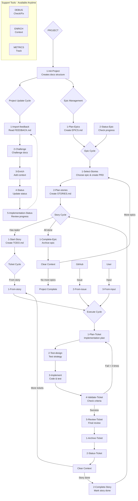

# Claude WM CLI

An intelligent Go-based command-line interface that acts as a wrapper around `claude -p "/command"` execution. Provides guided interactive workflow management for solo developers with context-aware suggestions and seamless Claude Code integration.

## Project Structure

```
docs/
├── 1-project/          # Global project vision and roadmap
├── 2-current-epic/     # Current epic execution
├── 3-current-task/     # Current task breakdown
└── archive/            # Completed epics backup
```

## Features

- **Guided Interactive Interface**: Run `claude-wm-cli` and get contextual options - no commands to memorize
- **Go-Based Performance**: Single binary deployment with fast JSON state parsing
- **Solo Developer Focused**: Designed for individual developers with simple, efficient workflows
- **Intelligent Command Orchestration**: Seamlessly wraps `claude -p "/command"` with context awareness
- **Hierarchical Workflow Management**: PROJECT → EPIC → STORY → TICKET progression with interruption handling
- **Dual Operation Modes**: Interactive terminal interface and headless mode for VSCode extension
- **Optional MCP Enhancements**: Works fully without external dependencies, enhanced when available

## How It Works

**You never need to memorize complex commands!** Just run `claude-wm-cli` and you'll be presented with contextual options based on your project's current state.

### Behind the Scenes
Commands follow a hierarchical path-based structure that the CLI manages internally:
`/{category}/{subcategory}/{command-name}` → `/{category}:{subcategory}:{command-name}`

### Core Workflow Commands

#### Project Level (`/1-project:*`)
- **Init**: `/1-project:1-start:1-Init-Project` - Initialize project structure
- **Update**: `/1-project:2-update:*` - Import feedback, challenge docs, enrich context
- **Epics**: `/1-project:3-epics:*` - Plan and manage epic roadmap

#### Epic Level (`/2-epic:*`)
- **Start**: `/2-epic:1-start:*` - Select and plan epic stories
- **Manage**: `/2-epic:2-manage:*` - Track progress and complete epics

#### Story Level (`/3-story:*`)
- **Manage**: `/3-story:1-manage:*` - Start stories and extract technical tasks

#### Ticket Level (`/4-ticket:*`)
- **Create**: `/4-ticket:1-start:*` - Generate tickets from stories, issues, or input
- **Execute**: `/4-ticket:2-execute:*` - 5-phase implementation process
- **Complete**: `/4-ticket:3-complete:*` - Archive and update status

#### Support Tools
- **DEBUG**: `/debug:*` - Project health monitoring and repair
- **ENRICH**: `/enrich:*` - Context enhancement and pattern discovery
- **METRICS**: `/metrics:*` - Performance tracking and analytics
- **LEARNING**: `/learning:*` - Pattern recognition and optimization
- **VALIDATION**: `/validation:*` - Architecture review and quality assurance

## Workflow Architecture



## Quick Start

### Simple Usage
1. **Install**: Download the Go binary for your platform
2. **Run**: `claude-wm-cli` in your project directory
3. **Follow**: Interactive prompts based on your project's current state

### Example Interactive Flow
```
$ claude-wm-cli

📋 Claude WM CLI - Project not initialized
Choose an option:
1. Initialize new project
2. Exit

Your choice: 1

✅ Project initialized!
Choose what to do next:
1. Import feedback (FEEDBACK.md detected)
2. Plan project epics
3. Check project status
4. Exit

Your choice: 1
```

### Interruption Handling
Need to handle urgent work? The CLI supports interruptions seamlessly:
- **GitHub Issues**: Automatically creates tickets from issues within the current story branch
- **Direct Input**: Create tickets from your direct requirements
- **Emergency Fixes**: Added as tickets to current story, or create dedicated "Hotfixes" story if needed
- **No Orphaned Branches**: All interruptions integrate into existing workflow structure

### Context-Aware Intelligence
The CLI analyzes your project state and suggests appropriate next actions based on:
- Presence of `.claude-wm/state.json` and other state files
- Existing documentation structure (epics, stories, tickets)
- Current workflow position and dependencies
- Available GitHub issues and external input

**Progressive Guidance**: Always shows where you are and suggests the logical next step. Future "implement everything" mode will automate entire epic/story implementation once planning is complete.

## Development Roadmap

### Phase 1: Interactive CLI Core (Current)
- Go-based CLI with Cobra/Bubble Tea interface
- JSON state management (state.json, epics.json, stories.json, tickets.json)
- Interactive navigation and contextual options
- Claude Code command wrapper with error handling

### Phase 2: Headless Mode
- JSON API mode for programmatic access (never concurrent with interactive CLI)
- Structured logging and debugging with intermediate status guides
- VSCode extension preparation with CLI separation

### Phase 3: VSCode Extension
- Visual workflow representation using CLI in headless mode
- Real-time project state synchronization (extension calls CLI, displays JSON)
- Integrated development experience with strict CLI-extension separation

## Target Audience

**Solo Developers** who want:
- Streamlined project workflow management with guided navigation
- Context-aware development guidance and next-step suggestions
- Integration with Claude Code commands through intelligent wrapper
- Simple, efficient tools without complexity overhead
- Pragmatic MVP approach - if it doesn't work, rollback and retry

**Note**: Team collaboration not currently planned - focused on solo developer experience first.

## License

[Add your license here]