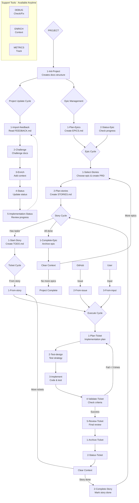

# Claude WM CLI

A robust Go-based CLI tool for agile project management that provides guided interactive workflow management for solo developers. Features comprehensive state management, interruption handling, and integration with Git and GitHub.

## Project Structure

```
docs/
├── 1-project/          # Global project vision and roadmap
├── 2-current-epic/     # Current epic execution
├── 3-current-task/     # Current task breakdown
└── archive/            # Completed epics backup

cmd/                    # CLI commands and main entry point
internal/               # Internal packages and business logic
├── epic/               # Epic management and tracking
├── story/              # Story generation and management
├── task/             # Ticket/interruption handling
├── navigation/         # Interactive menu system
├── state/              # JSON state management with atomicity
├── backup/             # Backup and recovery system
├── git/                # Git integration and versioning
├── github/             # GitHub API integration
├── locking/            # File locking for concurrency
└── workflow/           # Workflow analysis and validation
```

## Current Implementation Status

✅ **Fully Implemented and Tested**:
- **Epic Management**: Create, update, track, and complete epics with dashboard
- **Story Management**: Generate stories from epics with automated task extraction
- **Task/Interruption System**: Handle urgent tasks, GitHub issues, and context switching
- **Interactive Navigation**: Menu-driven CLI with contextual suggestions
- **State Management**: Atomic JSON operations with corruption protection
- **Git Integration**: Automatic versioning, backup, and recovery
- **GitHub Integration**: Issue synchronization and OAuth support
- **File Locking**: Multi-platform concurrent access prevention
- **Backup/Recovery**: Automated backup with retention policies
- **Cross-Platform Support**: Windows and Unix compatibility

🔄 **Partially Complete**:
- Interactive menu execution (some actions need completion)
- Context restoration for interruption stack
- Task-level CRUD operations in CLI

## Key Features

- **Atomic State Management**: All state changes use atomic file operations to prevent corruption
- **Interruption Stack**: Context-aware interruption handling with full state preservation
- **Git-Backed Versioning**: Automatic commit and backup of all project state
- **Concurrent Access Protection**: File locking prevents multiple instances
- **GitHub Integration**: Seamless issue import and synchronization
- **Performance Optimized**: Efficient JSON parsing with large file support
- **Comprehensive Testing**: High test coverage with unit and integration tests

## How It Works

**You never need to memorize complex commands!** Just run `claude-wm-cli` and you'll be presented with contextual options based on your project's current state.

### Behind the Scenes
Commands follow a hierarchical path-based structure that the CLI manages internally:
`/{category}/{subcategory}/{command-name}` → `/{category}:{subcategory}:{command-name}`

### Core Workflow Commands

#### Project Level (`/1-project:*`)
- **Init**: `/1-project:1-start:1-Init-Project` - Initialize project structure
- **Update**: `/1-project:2-update:*` - Import feedback, challenge docs, enrich context
- **Epics**: `/1-project:3-epics:*` - Plan and manage epic roadmap

#### Epic Level (`/2-epic:*`)
- **Start**: `/2-epic:1-start:*` - Select and plan epic stories
- **Manage**: `/2-epic:2-manage:*` - Track progress and complete epics

#### Story Level (`/3-story:*`)
- **Manage**: `/3-story:1-manage:*` - Start stories and extract technical tasks

#### Task Level (`/4-task:*`)
- **Create**: `/4-task:1-start:*` - Generate tickets from stories, issues, or input
- **Execute**: `/4-task:2-execute:*` - 5-phase implementation process
- **Complete**: `/4-task:3-complete:*` - Archive and update status

#### Support Tools
- **DEBUG**: `/debug:*` - Project health monitoring and repair
- **ENRICH**: `/enrich:*` - Context enhancement and pattern discovery
- **METRICS**: `/metrics:*` - Performance tracking and analytics
- **LEARNING**: `/learning:*` - Pattern recognition and optimization
- **VALIDATION**: `/validation:*` - Architecture review and quality assurance

## Workflow Architecture



## Quick Start

### Installation & Usage
1. **Build**: `make build` (requires Go 1.21+)
2. **Run**: `./claude-wm-cli` or `claude-wm-cli` if installed
3. **Interactive**: Use interactive menus or direct commands

### Available Commands
```bash
# Core workflow commands
claude-wm-cli epic create "Epic Name"
claude-wm-cli story list
claude-wm-cli ticket create --from-input "Description"
claude-wm-cli interactive                    # Interactive menu

# Management commands  
claude-wm-cli status                      # Project status
claude-wm-cli lock status                # Check file locks
claude-wm-cli backup create              # Manual backup

# GitHub integration
claude-wm-cli github sync                # Sync issues
claude-wm-cli ticket create --from-issue 123
```

### Example Interactive Session
```
$ claude-wm-cli interactive

🎯 Claude WM CLI - Current Epic: API Development
┌─ Epic Status ─────────────────────────────┐
│ Progress: 3/5 stories completed           │  
│ Active: User Authentication Story         │
│ Next: Story selection or ticket creation  │
└───────────────────────────────────────────┘

Choose an action:
1. 📋 View epic dashboard
2. 📝 Start new story  
3. 🎫 Create ticket (interruption)
4. 🔄 Continue current story
5. ⚙️  Project settings

Your choice: 4
```

### Interruption Handling
Need to handle urgent work? The CLI supports interruptions seamlessly:
- **GitHub Issues**: Automatically creates tickets from issues within the current story branch
- **Direct Input**: Create tickets from your direct requirements
- **Emergency Fixes**: Added as tickets to current story, or create dedicated "Hotfixes" story if needed
- **No Orphaned Branches**: All interruptions integrate into existing workflow structure

### Context-Aware Intelligence
The CLI analyzes your project state and suggests appropriate next actions based on:
- Presence of `.claude-wm/state.json` and other state files
- Existing documentation structure (epics, stories, tickets)
- Current workflow position and dependencies
- Available GitHub issues and external input

**Progressive Guidance**: Always shows where you are and suggests the logical next step. Future "implement everything" mode will automate entire epic/story implementation once planning is complete.

## Development Roadmap

### Phase 1: Interactive CLI Core (Current)
- Go-based CLI with Cobra/Bubble Tea interface
- JSON state management (state.json, epics.json, stories.json, tickets.json)
- Interactive navigation and contextual options
- Claude Code command wrapper with error handling

### Phase 2: Headless Mode
- JSON API mode for programmatic access (never concurrent with interactive CLI)
- Structured logging and debugging with intermediate status guides
- VSCode extension preparation with CLI separation

### Phase 3: VSCode Extension
- Visual workflow representation using CLI in headless mode
- Real-time project state synchronization (extension calls CLI, displays JSON)
- Integrated development experience with strict CLI-extension separation

## Target Audience

**Solo Developers** who want:
- Streamlined project workflow management with guided navigation
- Context-aware development guidance and next-step suggestions
- Integration with Claude Code commands through intelligent wrapper
- Simple, efficient tools without complexity overhead
- Pragmatic MVP approach - if it doesn't work, rollback and retry

**Note**: Team collaboration not currently planned - focused on solo developer experience first.

## License

[Add your license here]