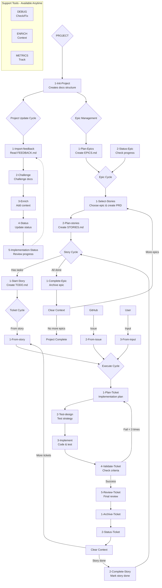

Je voudrais un binaire qui tourne en ligne de commande, appelé "claude-wm-cli" qui serait un wrapper intelligent des commandes Claude qui j'ai dans $HOME/.claude/commands.
On peut lancer la commande en interractive (pour faire ça manuellement depuis un terminal) ou en headless (pour faire ça depuis une extension VSCode plus tard)

Voici des infos sur le workflow prévu mais qui est aujourd'hui manuel :


## Workflow Architecture



## Command Structure
**Note**: Commands are located in `.claude/commands/` directory. Each command name is based on its path and follows the pattern:
`/{category}/{subcategory}/{command-name}` → `/{category}:{subcategory}:{command-name}`

### 1-PROJECT (Project Level)
- **Init**: Initialize comprehensive project structure with git integration
  - `/1-project:1-start:1-Init-Project` - Creates docs/1-project/, docs/2-current-epic/, docs/3-current-task/, docs/archive/ folders, generates README.md, METRICS.md, CLAUDE.md from templates, initializes git with main/develop branches, and creates initial commit → Next: `/1-project:3-epics:1-Plan-Epics`
- **Update**: MCP-powered deep project analysis and continuous improvement cycle 
  - `/1-project:2-update:1-Import-feedback` - Import external feedback from FEEDBACK.md into project documentation for strategic improvements → Next: `/1-project:2-update:2-Challenge`
  - `/1-project:2-update:2-Challenge` - Execute MCP-powered deep analysis using consult7 for full codebase scan, sequential-thinking for architecture analysis, mem0 for historical context, and context7 for best practices. Generates data-driven strategic questions and creates evidence-based FEEDBACK.md → Next: `/1-project:2-update:3-Enrich`
  - `/1-project:2-update:3-Enrich` - Enhance project context with actionable patterns, architectural insights, and development workflow improvements → Next: `/1-project:2-update:4-Status`
  - `/1-project:2-update:4-Status` - Comprehensive project health check and status update across all levels → Next: `/1-project:2-update:5-Implementation-Status`
  - `/1-project:2-update:5-Implementation-Status` - Detailed implementation progress review with gap analysis → Next: Continue development
- **Epics**: Strategic epic planning and lifecycle management
  - `/1-project:3-epics:1-Plan-Epics` - Create comprehensive EPICS.md with prioritized epic roadmap, dependencies, and success criteria → Next: `/2-epic:1-start:1-Select-Stories`
  - `/1-project:3-epics:2-Update-Implementation` - Track and update epic implementation status across the project → Next: Continue epic work

### 2-EPIC (Epic Level) 
- **Select**: Intelligent epic selection and workspace initialization
  - `/2-epic:1-start:1-Select-Stories` - Parse EPICS.md for highest priority unstarted epic (P0 > P1 > P2 > P3), copy epic to docs/2-current-epic/PRD.md, create epic-specific CLAUDE.md context, create feature/{epic-name} branch, and mark epic as "🚧 In Progress" with dependency verification → Next: `/2-epic:1-start:2-Plan-stories`
- **Plan Stories**: Epic decomposition into user stories with acceptance criteria
  - `/2-epic:1-start:2-Plan-stories` - Break epic into manageable stories with detailed acceptance criteria, technical requirements, and dependency mapping in STORIES.md → Next: `/3-story:1-manage:1-Start-Story`
- **Manage**: Epic completion and progress tracking
  - `/2-epic:2-manage:1-Complete-Epic` - Archive completed epic to docs/archive/, update metrics, and prepare for next epic → Next: clear the context with `/clear` then either `/2-epic:1-start:1-Select-Stories` or project completion
  - `/2-epic:2-manage:2-Status-Epic` - Comprehensive epic progress analysis with blocker identification and resolution strategies → Next: Continue epic work

### 3-STORY (Story Level)
- **Start**: Story selection and technical task extraction
  - `/3-story:1-manage:1-Start-Story` - Identify highest priority unstarted story (P0 > P1 > P2 > P3), verify dependencies, create story/{epic-name}/{story-id} branch, extract technical tasks into docs/2-current-epic/TODO.md, and mark story "🚧 In Progress" → Next: `/4-task:1-start:1-From-story`
- **Complete**: Story finalization and progress updates
  - `/3-story:1-manage:2-Complete-Story` - Mark story complete in STORIES.md, update documentation, and prepare for next story or epic completion → Next: `/3-story:1-manage:1-Start-Story` or `/2-epic:2-manage:1-Complete-Epic`

### 4-task (Ticket Level)
- **Create**: Multi-source ticket generation with context initialization
  - `/4-task:1-start:1-From-story` - Generate implementation ticket from current story with technical task breakdown → Next: `/4-task:2-execute:1-Plan-Ticket`
  - `/4-task:1-start:2-From-issue` - Query GitHub issues with gh CLI, prioritize by age/severity, create fix/issue-{number} branch, initialize docs/3-current-task/ with issue analysis and reproduction steps → Next: `/4-task:2-execute:1-Plan-Ticket`
  - `/4-task:1-start:3-From-input` - Create custom ticket from direct user input with workspace initialization → Next: `/4-task:2-execute:1-Plan-Ticket`
- **Execute**: MCP-enhanced 5-phase implementation process with intelligent assistance
  - `/4-task:2-execute:1-Plan-Ticket` - Create detailed implementation plan with mem0 pattern research, initialize ITERATIONS.md tracking, generate TASK.md from template with approach and file changes, include mandatory regression testing strategy covering automated tests, performance baselines, and integration validation → Next: `/4-task:2-execute:2-Test-design`
  - `/4-task:2-execute:2-Test-design` - Design comprehensive test strategy including unit, integration, UI automation (MCP-powered), performance, security, and manual test scenarios → Next: `/4-task:2-execute:3-Implement`
  - `/4-task:2-execute:3-Implement` - Execute intelligent implementation with MCP workflow: load previous patterns via mem0, get current documentation via context7, use sequential-thinking for complex features, implement with real-time validation via IDE diagnostics, capture successful patterns back to mem0 → Next: `/4-task:2-execute:4-Validate-Ticket`
  - `/4-task:2-execute:4-Validate-Ticket` - Validate implementation against acceptance criteria with comprehensive testing → Next: `/4-task:2-execute:5-Review-Ticket`
  - `/4-task:2-execute:5-Review-Ticket` - Final code review, documentation updates, and quality assurance → Next: `/4-task:3-complete:1-Archive-Ticket`
- **Complete**: Ticket archival and status management
  - `/4-task:3-complete:1-Archive-Ticket` - Archive completed ticket with implementation summary and lessons learned → Next: `/4-task:3-complete:2-Status-Ticket`
  - `/4-task:3-complete:2-Status-Ticket` - Update ticket status across all documentation levels → Next: Clear the context with `/clear` then either next ticket with `/4-task:1-start:1-From-story` or end the story with `/3-story:1-manage:2-Complete-Story`

### Support Tools
- **DEBUG**: Comprehensive project health monitoring and repair
  - `/debug:1-Check-state` - Verify git repository status, folder structure integrity, epic/story/task consistency, branch alignment, and generate actionable health score with specific next action recommendations → Next: `/debug:2-Fix-structure` if issues found
  - `/debug:2-Fix-structure` - Automated repair of project structure issues, workflow inconsistencies, and workspace problems → Next: Resume normal workflow
- **ENRICH**: Multi-level Claude context enhancement with pattern discovery
  - `/enrich:1-claude:1-Global` - Analyze project evolution, extract successful patterns from mem0 and codebase, update global CLAUDE.md with actionable patterns, commands, and development conventions → Next: Continue current workflow
  - `/enrich:1-claude:2-Epic` - Enrich epic-specific context with relevant architectural decisions and implementation patterns → Next: Continue epic work
  - `/enrich:1-claude:3-Post-ticket` - Update context after ticket completion with lessons learned and pattern refinements → Next: Continue development
- **METRICS**: Data-driven project performance tracking and optimization
  - `/metrics:1-manage:1-Update` - Collect comprehensive data from docs/archive/, git history, calculate velocity trends, quality metrics, success rates, and iteration efficiency → Next: `/metrics:1-manage:2-Dashboard`
  - `/metrics:1-manage:2-Dashboard` - Generate visual metrics dashboard with performance indicators, trend analysis, and actionable optimization insights → Next: Continue workflow
- **LEARNING**: Advanced learning analytics and pattern recognition system
  - `/learning:dashboard` - Comprehensive learning analytics using mem0: analyze complete memory for patterns, calculate performance metrics (success rate, velocity, efficacy), identify top success/failure patterns, assess technology effectiveness, generate learning system health score, provide optimization recommendations → Next: Continue development
- **VALIDATION**: Architectural quality assurance and deep analysis
  - `/validation:1-Architecture-Review` - Execute comprehensive MCP-powered architecture analysis: full codebase mapping via consult7, pattern recognition, dependency analysis, scalability assessment, performance review, security audit, maintainability evaluation. Generates detailed reports (ARCHITECTURE-ANALYSIS.md, DEPENDENCY-GRAPH.md, PERFORMANCE-REPORT.md, SECURITY-AUDIT.md) with prioritized improvement roadmap → Next: Implement recommendations

## Development Cycle
```
Project Init → Epic Planning → Story Breakdown → Ticket Execution → Review & Archive
     ↑                                                                      ↓
     └──────────────────── Iterate & Improve ←─────────────────────────────┘
```

## File Organization
- `docs/1-project/` - Project vision and architecture
- `docs/2-current-epic/` - Active epic documentation  
- `docs/3-current-task/` - Current ticket implementation
- `docs/archive/` - Completed work history

## Workflow state
path: ${PROJECT}/.claude-wm/state.json
```json
{
  "isInitialized": true,
  "commandHistory": [],
  "projectMetadata": {
    "name": "Claude WM CLI",
    "version": "1.0.0",
    "description": "Claude Workflow Manager Project"
  },
  "settings": {
    "autoSave": true,
    "logRetentionDays": 30
  },
  "hasExecutedImportFeedback": false,
  "hasExecutedPlanEpics": false,
  "lastUpdated": 1753429853403
}
```

## Application Logic Flow

### 1. Command Launch
La commande `claude-wm-cli` démarre en mode interactif ou headless

### 2. Project State Detection
Détection dans le dossier en cours du `.claude-wm/state.json`:
- **Si absent**: On ne propose que d'initialiser le projet avec `/1-project:1-start:1-Init-Project`
- **Si présent**: On continue avec l'analyse contextuelle

### 3. Context Analysis & Command Suggestions
Analyse du contexte projet et suggestion de commande appropriée:

#### Mode PROJECT (mise à jour et amélioration du projet)
- **Si FEEDBACK.md présent et différent du template**:
  - Suggestion: `/1-project:2-update:1-Import-feedback`
  - Prochaine étape: `/1-project:2-update:2-Challenge`
  
- **Si README.md existe + fichiers dans docs/1-project/**:
  - Suggestion: `/1-project:2-update:2-Challenge`
  - Prochaine étape: `/1-project:2-update:3-Enrich`
  
- **Si docs/1-project/TECHNICAL.md existe**:
  - Suggestion: `/1-project:2-update:3-Enrich`
  - Prochaine étape: `/1-project:2-update:4-Status`
  
- **Si docs/1-project/EPICS.md existe**:
  - Suggestion: `/1-project:2-update:4-Status`
  - Prochaine étape: `/1-project:2-update:5-Implementation-Status`
  
- **Si docs/1-project/IMPLEMENTATION.md existe**:
  - Suggestion: `/1-project:2-update:5-Implementation-Status`
  - Prochaine étape: Continue development

#### Mode EPIC (gestion des épics)
- **Si aucun epic dans docs/1-project/EPICS.md**:
  - Suggestion: `/1-project:3-epics:1-Plan-Epics`
  - Prochaine étape: `/2-epic:1-start:1-Select-Stories`
  
- **Si épics planifiés mais aucun en cours**:
  - Suggestion: `/2-epic:1-start:1-Select-Stories`
  - Prochaine étape: `/2-epic:1-start:2-Plan-stories`
  
- **Si epic en cours (docs/2-current-epic/PRD.md existe)**:
  - Suggestion: `/2-epic:2-manage:2-Status-Epic`
  - Options: Continuer epic ou `/2-epic:2-manage:1-Complete-Epic`

#### Mode STORY (gestion des stories)
- **Si docs/2-current-epic/STORIES.md existe mais aucune story en cours**:
  - Suggestion: `/3-story:1-manage:1-Start-Story`
  - Prochaine étape: `/4-task:1-start:1-From-story`
  
- **Si story en cours mais TODO.md manquant**:
  - Suggestion: `/3-story:1-manage:1-Start-Story`
  - Prochaine étape: `/4-task:1-start:1-From-story`

#### Mode TICKET (implémentation)
- **Si docs/2-current-epic/TODO.md existe avec tâches [ ] restantes**:
  - Suggestion: `/4-task:1-start:1-From-story`
  - Prochaine étape: `/4-task:2-execute:1-Plan-Ticket`
  
- **Si docs/3-current-task/ existe avec ticket en cours**:
  - Analyser l'état du ticket actuel:
    - Si TASK.md existe sans ITERATIONS.md: `/4-task:2-execute:1-Plan-Ticket`
    - Si plan créé sans tests: `/4-task:2-execute:2-Test-design`
    - Si tests conçus sans implémentation: `/4-task:2-execute:3-Implement`
    - Si implémenté sans validation: `/4-task:2-execute:4-Validate-Ticket`
    - Si validé sans review: `/4-task:2-execute:5-Review-Ticket`
    - Si reviewé: `/4-task:3-complete:1-Archive-Ticket`

#### Mode COMPLETION (finalisation)
- **Si toutes les tâches de TODO.md sont [x] complétées**:
  - Suggestion: `/3-story:1-manage:2-Complete-Story`
  - Prochaine étape: `/3-story:1-manage:1-Start-Story` ou `/2-epic:2-manage:1-Complete-Epic`
  
- **Si toutes les stories de STORIES.md sont complétées**:
  - Suggestion: `/2-epic:2-manage:1-Complete-Epic`
  - Prochaine étape: Clear context + `/2-epic:1-start:1-Select-Stories` ou fin de projet

### 4. Special Cases & Support Tools

#### GitHub Integration
- **Si issues GitHub disponibles**: Proposer `/4-task:1-start:2-From-issue`
- **Si input utilisateur direct**: Proposer `/4-task:1-start:3-From-input`

#### Maintenance & Debug
- **Si structure projet corrompue**: Proposer `/debug:1-Check-state` puis `/debug:2-Fix-structure`
- **Si performance dégradée**: Proposer `/metrics:1-manage:1-Update` puis `/metrics:1-manage:2-Dashboard`
- **Si contexte obsolète**: Proposer `/enrich:1-claude:1-Global`, `/enrich:1-claude:2-Epic`, ou `/enrich:1-claude:3-Post-ticket`

#### Analytics & Learning
- **Périodiquement**: Proposer `/learning:dashboard` pour optimiser les patterns
- **Pour review architecture**: Proposer `/validation:1-Architecture-Review`

### 5. Command Flow Logic
```
Detection → Analysis → Contextual Suggestion → Next Step Prediction → Execution → State Update
```

Chaque commande met à jour le `state.json` et influence la prochaine suggestion contextuelle, créant un workflow intelligent et adaptatif.
            
---

**Processed**: 2025-07-25 10:39:55 CET
**Integration Status**: 
- ✅ Technical insights integrated into ARCHITECTURE.md
- ✅ Presentation updates merged into README.md
- ✅ No contradictions found with existing content