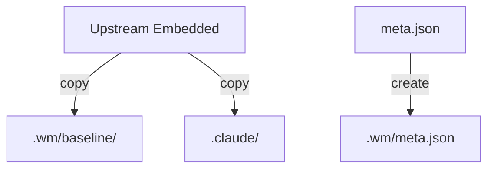
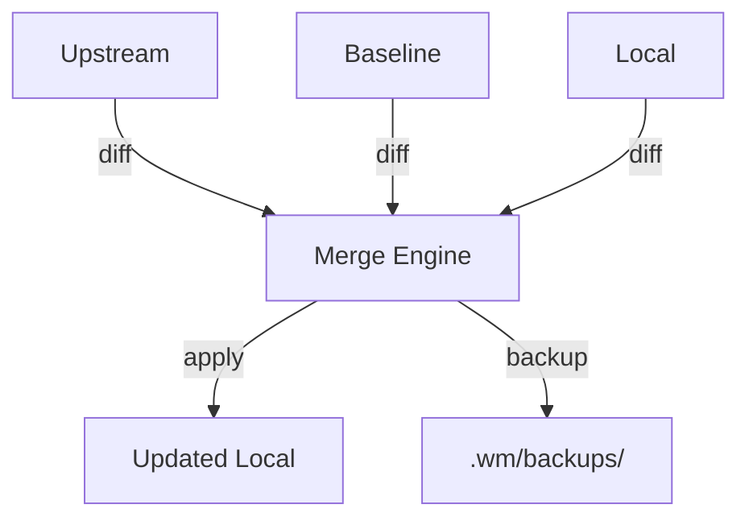
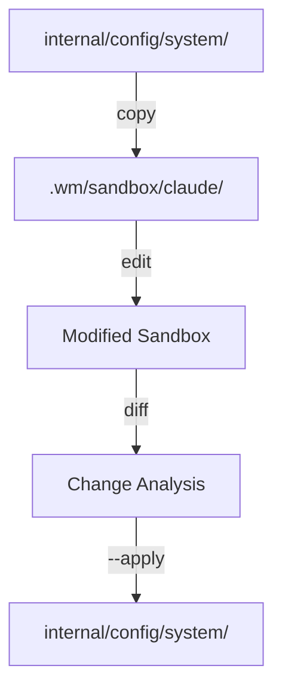
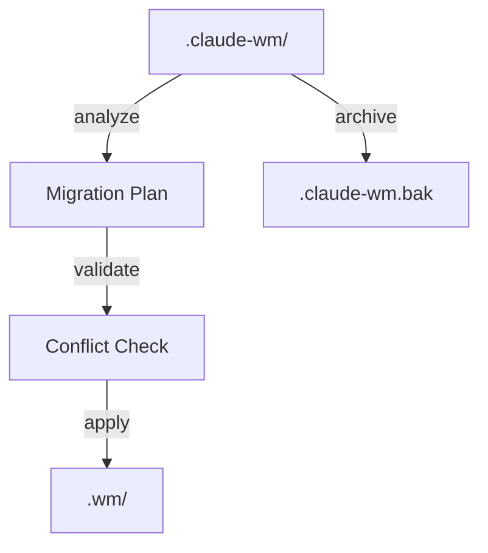

# Architecture Guide

This document describes the system architecture, components, data flows, and design principles of Claude WM CLI.

## Overview

Claude WM CLI is built using **Clean Architecture** principles with a focus on configuration management, sandbox development, and workflow automation. The system manages multiple configuration spaces with atomic operations and comprehensive validation.

## Core Architecture Principles

### Clean Architecture Layers

```
┌─────────────────────────────────────────────────────────────┐
│                    External Interfaces                       │
├─────────────────────────────────────────────────────────────┤
│                  Application Services                        │
├─────────────────────────────────────────────────────────────┤
│                    Domain Logic                             │
└─────────────────────────────────────────────────────────────┘
```

1. **Domain Layer** (`internal/domain/`): Core business logic, entities, and rules
2. **Application Layer** (`internal/application/`): Use cases and orchestration
3. **Infrastructure Layer** (`internal/infrastructure/`): External concerns (file I/O, JSON)
4. **Interface Layer** (`cmd/`, `internal/interfaces/`): CLI adapters and external interfaces

### Design Invariants

- **Atomic Operations**: All file operations use temp+rename pattern
- **Immutable Baselines**: `.wm/baseline/` is never modified after installation
- **Bounded Contexts**: Each component has clear write boundaries
- **Idempotent Operations**: Commands can be run multiple times safely
- **Validation First**: All operations validate before applying changes

## Configuration Spaces

The system manages four distinct configuration spaces:

### 1. Upstream (Embedded)
- **Location**: `internal/config/system/` (embedded in binary)
- **Purpose**: Read-only system templates and configurations
- **Access**: `config.EmbeddedFS`
- **Updates**: Only via binary updates

### 2. Baseline (`.wm/baseline/`)
- **Location**: `.wm/baseline/`
- **Purpose**: Snapshot of installed system configuration
- **Creation**: `config install` command
- **Immutability**: Never modified after creation
- **Use**: Reference point for 3-way merges

### 3. Local (`.claude/`)
- **Location**: `.claude/`
- **Purpose**: Runtime configuration used by Claude Code
- **Management**: Auto-generated from templates and user customizations
- **Updates**: `config update`, `config sync`

### 4. Sandbox (`.wm/sandbox/claude/`)
- **Location**: `.wm/sandbox/claude/`
- **Purpose**: Isolated testing environment
- **Creation**: `dev sandbox` command
- **Use**: Safe experimentation without affecting production

## Core Components

### Configuration Manager (`internal/config/manager.go`)

Orchestrates all configuration operations:

```go
type Manager struct {
    WorkspaceRoot string // .wm root directory
    SystemPath    string // system/ templates
    UserPath      string // user/ overrides  
    RuntimePath   string // runtime/ generated config
}
```

**Key Responsibilities:**
- Installation of system templates
- 3-way merge operations
- Runtime configuration generation
- Legacy migration

### Diff Engine (`internal/diff/`)

Compares file trees and generates change sets:

```go
type Change struct {
    Path string
    Type ChangeType // "new", "mod", "del"
}
```

**Operations:**
- Tree-to-tree comparison using SHA256 hashes
- Change classification and reporting
- Conflict detection

### Sandbox System (`internal/cmd/dev_sandbox*.go`)

Provides isolated development environment:

**Components:**
- Sandbox creation from system templates
- Diff analysis between sandbox and source
- Selective upstreaming of changes
- Pattern-based filtering

### Migration Engine (`internal/cmd/config_migrate_legacy.go`)

Handles migration from legacy `.claude-wm/` to `.wm/` structure:

**Features:**
- Structure analysis and categorization
- Selective migration strategies
- Conflict detection and resolution
- Archive and rollback support

## Data Flows

### Installation Flow



1. `config install` copies embedded templates to both baseline and local
2. Creates workspace metadata
3. Establishes baseline for future merges

### Update Flow (3-Way Merge)



1. Compare Upstream vs Baseline (system changes)
2. Compare Baseline vs Local (user changes) 
3. Calculate merge actions: keep, apply, preserve_local, conflict
4. Create backup before applying
5. Apply non-conflicting changes

### Sandbox Development Flow



1. Create sandbox from system templates
2. User makes experimental changes
3. Compare sandbox with original source
4. Selectively upstream approved changes

### Migration Flow



1. Analyze legacy structure and categorize files
2. Generate migration plan with dispositions
3. Validate target directory and check conflicts
4. Apply migration and optionally archive legacy

## Command Architecture

### Command Registration

Commands are organized hierarchically using Cobra:

```
root (claude-wm-cli)
├── config
│   ├── install
│   ├── status  
│   ├── update
│   ├── sync
│   ├── upgrade
│   ├── show
│   └── migrate-legacy
├── dev  
│   └── sandbox
│       └── diff
├── guard
│   ├── check
│   └── install-hook
└── [other commands...]
```

### Command Implementation Pattern

Each command follows this pattern:

1. **Validation**: Input and state validation
2. **Planning**: Generate operation plan (with --dry-run support)
3. **Confirmation**: User confirmation for destructive operations
4. **Execution**: Atomic application of changes
5. **Reporting**: Status and results reporting

## File System Boundaries

### Write Permissions by Command

| Command | `.claude/` | `.wm/baseline/` | `.wm/backups/` | `.wm/sandbox/` | `.wm/meta.json` |
|---------|------------|-----------------|----------------|----------------|------------------|
| `config install` | ✅ Create | ✅ Create | ❌ | ❌ | ✅ Create |
| `config status` | ❌ Read-only | ❌ Read-only | ❌ | ❌ | ❌ Read-only |
| `config update` | ✅ Update | ❌ Read-only | ✅ Create | ❌ | ❌ Read-only |
| `config sync` | ✅ Update | ❌ Read-only | ❌ | ❌ | ❌ Read-only |
| `dev sandbox` | ❌ | ❌ Read-only | ❌ | ✅ Create/Update | ❌ |
| `dev sandbox diff --apply` | ❌ | ❌ | ❌ | ❌ Read-only | ❌ |
| `config migrate-legacy` | ❌ | ❌ | ❌ | ❌ | ✅ Create |

### Protected Directories

- **`.claude/`**: Only modified by config commands, never by sandbox or dev tools
- **`.wm/baseline/`**: Immutable after installation
- **`internal/config/system/`**: Only modified by `dev sandbox diff --apply`

## State Management

### Atomic Operations

All file modifications use the atomic temp+rename pattern:

```go
func atomicWrite(path string, data []byte) error {
    temp := path + ".tmp"
    if err := os.WriteFile(temp, data, 0644); err != nil {
        return err
    }
    return os.Rename(temp, path)
}
```

### Backup Strategy

- **Automatic Backups**: Created before destructive operations
- **Timestamped**: Using `YYYY-MM-DD_HH-MM-SS` format
- **Compressed**: ZIP format in `.wm/backups/`
- **Retention**: Configurable, manual cleanup

### Validation Pipeline

1. **Schema Validation**: JSON schema compliance
2. **Business Rules**: Domain-specific validation  
3. **Referential Integrity**: Cross-file consistency
4. **File System**: Permissions and accessibility

## Error Handling

### Error Categories

1. **Validation Errors**: Input or state validation failures
2. **Conflict Errors**: Merge conflicts requiring manual resolution
3. **System Errors**: File I/O, permissions, or system-level issues
4. **User Errors**: Invalid usage or missing dependencies

### Error Recovery

- **Rollback**: Restore from backup on failure
- **Partial Recovery**: Continue with successful operations
- **Detailed Logging**: Comprehensive error context
- **Suggestions**: Actionable remediation steps

## Security Considerations

### File Permissions

- **Configuration Files**: `0644` (readable by owner and group)
- **Executable Hooks**: `0755` (executable by owner)
- **Directories**: `0755` (accessible by owner and group)

### Validation Guards

- **Pre-commit Hooks**: Validate changes before commit
- **Schema Validation**: Ensure JSON structure integrity
- **Path Traversal**: Prevent directory traversal attacks
- **Input Sanitization**: Validate all user inputs

## Performance Characteristics

### Optimization Strategies

1. **Lazy Loading**: Load configurations only when needed
2. **Caching**: Cache file hashes and metadata
3. **Parallel Operations**: Concurrent file processing where safe
4. **Incremental Updates**: Only process changed files

### Scalability Limits

- **File Count**: Optimized for projects with <10,000 files
- **File Size**: Individual files up to 100MB supported
- **Memory Usage**: O(n) where n is number of files
- **Disk I/O**: Minimized through diff-based operations

## Extensibility

### Plugin Architecture

The system is designed for future plugin support:

- **Command Plugins**: Additional commands via interfaces
- **Hook Plugins**: Custom validation and processing hooks  
- **Template Plugins**: Custom template engines
- **Storage Plugins**: Alternative storage backends

### Integration Points

- **CI/CD Integration**: Automation-friendly with `--dry-run` and JSON output
- **IDE Integration**: File watchers and development server support
- **External Tools**: Integration with git, editors, and build systems
- **API Endpoints**: Future REST API for external integrations