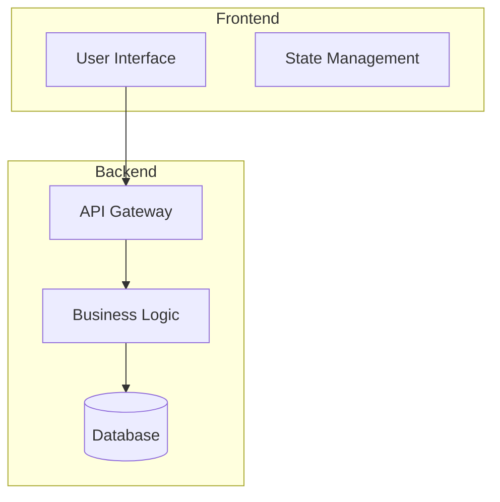

# System Architecture

## 🤖 SUBAGENT OPTIMIZATION ACTIVE
**This template now uses claude-wm-templates subagent for 93% token savings and 3x faster generation**

## Overview
{High-level description of the system in 2-3 sentences}

## Architecture Diagram

## Core Components
### 1. {Component Name}
- Purpose: {What it does}
- Technology: {Tech stack used}
- Interfaces: {How it connects}
- Dependencies: {What it needs}

### 2. {Component Name}
- Purpose: {What it does}
- Technology: {Tech stack used}
- Interfaces: {How it connects}
- Dependencies: {What it needs}

## Data Flow

1. User {action} → {component}
2. {Component} processes → {next component}
3. {Final component} returns → User

## Key Design Decisions
|Decision|Rationale|Trade-offs|
|{Architecture choice}|{Why chosen}|{Pros/Cons}|
|{Technology choice}|{Why chosen}|{Pros/Cons}|

## Security Architecture

Authentication: {method}
Authorization: {method}
Data encryption: {at rest/in transit}

## Scalability Strategy

Horizontal scaling: {approach}
Caching: {strategy}
Load balancing: {method}

## Integration Points

External API: {service name} - {purpose}
Third-party service: {name} - {purpose}